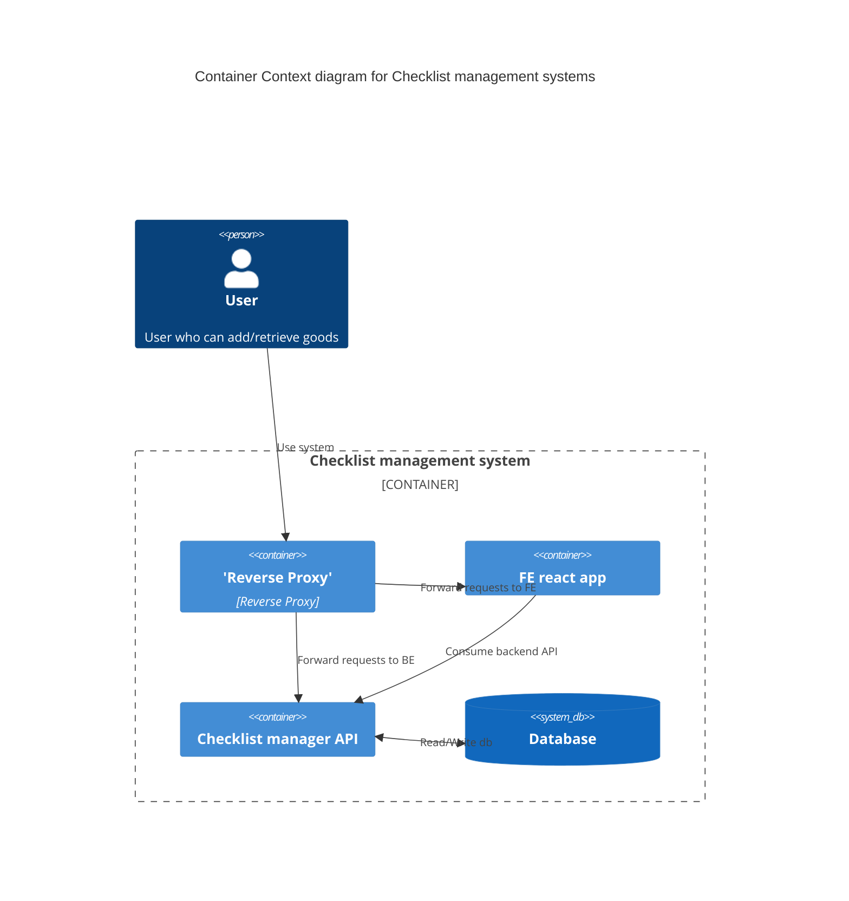

```mermaid
C4Container
      title Container Context diagram for Checklist management systems
        Person(user, "User", "User who can add/retrieve goods")
        Container_Boundary(checklist-manager-boundary, "Checklist management system") {
        Rel(user, proxy, "Use system")
        Rel(proxy, checklist-manager-be, "Forward requests to BE")
        Rel(proxy, checklist-manager-fe, "Forward requests to FE")
        Container(proxy, 'Reverse Proxy', "Reverse Proxy")
        Container(checklist-manager-fe, "FE react app")
        Container(checklist-manager-be, "Checklist manager API")
        SystemDb(checklist-manager-db, "Database")
        BiRel(checklist-manager-be, checklist-manager-db, "Read/Write db")
        Rel(checklist-manager-fe,checklist-manager-be, "Consume backend API")
      }
      UpdateLayoutConfig($c4ShapeInRow="2", $c4BoundaryInRow="2")
```
