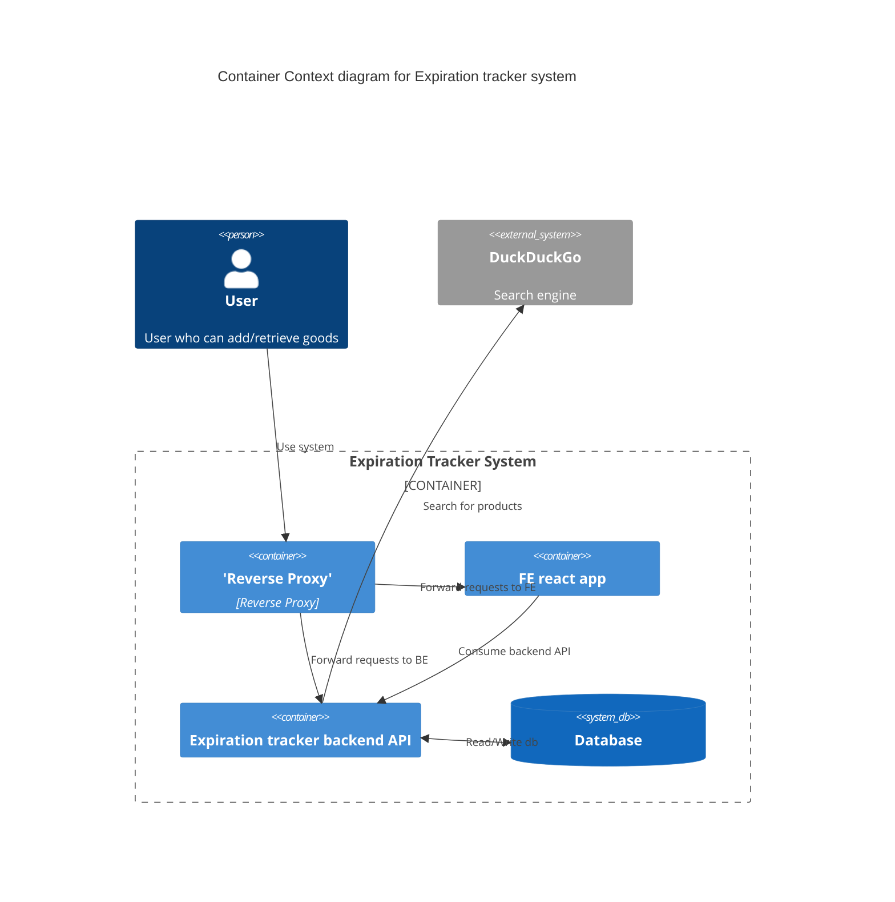

```mermaid
C4Container
      title Container Context diagram for Expiration tracker system
        Person(user, "User", "User who can add/retrieve goods")
        Container_Boundary(expiration-tracker-boundary, "Expiration Tracker System") {
        Rel(user, proxy, "Use system")
        Rel(proxy, expiration-tracker-be, "Forward requests to BE")
        Rel(proxy, expiration-tracker-fe, "Forward requests to FE")
        Container(proxy, 'Reverse Proxy', "Reverse Proxy")
        Container(expiration-tracker-fe, "FE react app")
        Container(expiration-tracker-be, "Expiration tracker backend API")
        SystemDb(expiration-tracker-db, "Database")
        BiRel(expiration-tracker-be, expiration-tracker-db, "Read/Write db")
        Rel(expiration-tracker-fe,expiration-tracker-be, "Consume backend API")
      }
      System_Ext('duckduckgo', "DuckDuckGo", "Search engine")
      Rel(expiration-tracker-be, 'duckduckgo', "Search for products")
      UpdateLayoutConfig($c4ShapeInRow="2", $c4BoundaryInRow="2")
```
