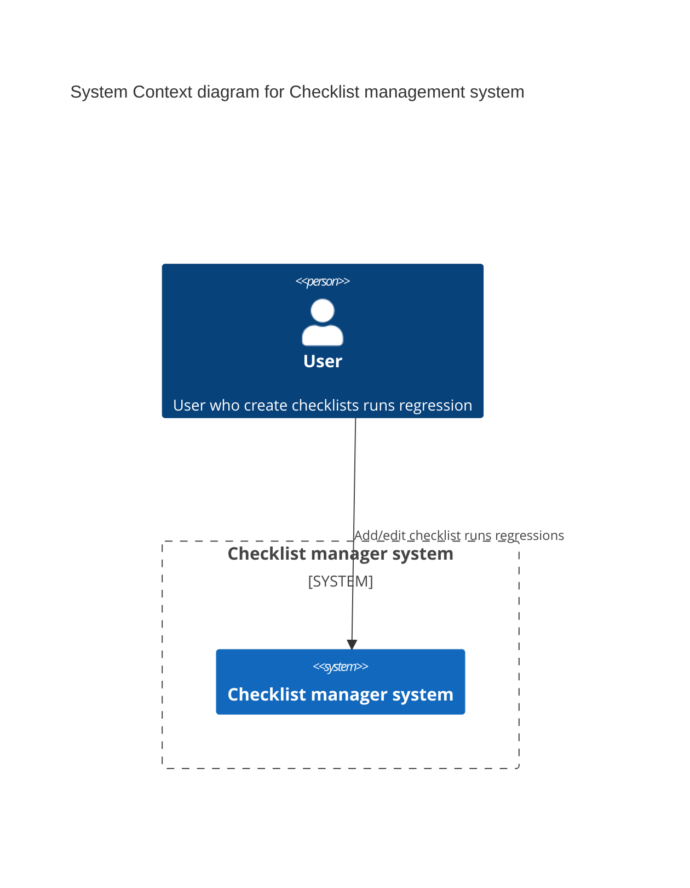

```mermaid
C4Context
      title System Context diagram for Checklist management system
      Person(user, "User", "User who create checklists runs regression")
      System_Boundary(checklist-manager-boundary, "Checklist manager system") {
        Rel(user,checklist-manager, "Add/edit checklist runs regressions")
        System(checklist-manager, "Checklist manager system")
      }
      UpdateLayoutConfig($c4ShapeInRow="2", $c4BoundaryInRow="1")
```
