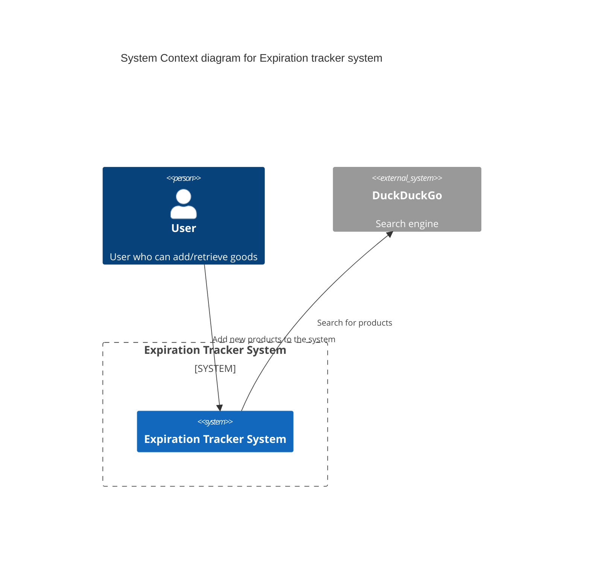

```mermaid
C4Context
      title System Context diagram for Expiration tracker system
      Person(user, "User", "User who can add/retrieve goods")
      System_Boundary(expiration-tracker-boundary, "Expiration Tracker System") {
        Rel(user,expiration-tracker, "Add new products to the system")
        System(expiration-tracker, "Expiration Tracker System")
      }
      System_Ext('duckduckgo', "DuckDuckGo", "Search engine")
      Rel(expiration-tracker, 'duckduckgo', "Search for products")
      UpdateLayoutConfig($c4ShapeInRow="2", $c4BoundaryInRow="1")
```
